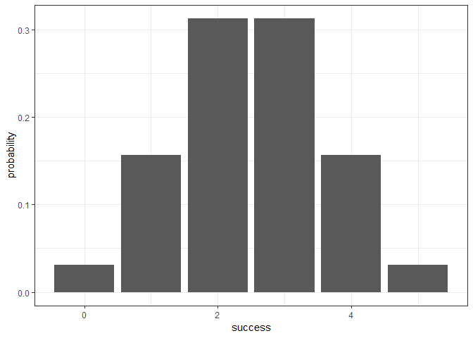
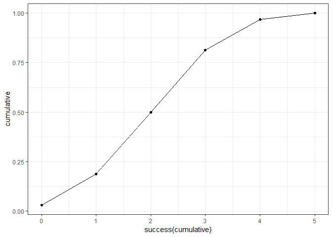

## Overview

`"package"` is a packagethat provides binomial distribution functions

that allow you to compute various calculations with tables and draw
plots.

  - `bin_distribution()` creates a bindis object (of class `bindis`). I
    call this `dis`

  - `plot(dis)` method for a `bindis` object to plot the distribution.

  - `bin_cumulative()` creates a bincum object (of class `bincum`), I
    call this `cum`

  - `plot(cum)` method for a `bincum` object to plot the distribution.

  - `bin_variable()` creates a binvar object (of class `"var"`). I call
    this ‘var’

  - `summary()` method for a `"var"` object that prints the summary of
    binomial variable such as mean, variance etc.

## Motivation

This is stat 133 workout3 that introduces us how to create our own
package

## Installation

To use this package, we must install this from GitHub via the package
`"devtools"`:

``` r

# development version from GitHub:

#install.packages("devtools") 


# install "packages" (without vignettes)

devtools::install_github("stat133-sp19/hw-stat133-jae1654/binomial")
#> Skipping install of 'binomial' from a github remote, the SHA1 (625ef71a) has not changed since last install.
#>   Use `force = TRUE` to force installation


# install "cointoss" (with vignettes)

devtools::install_github("stat133-sp19/hw-stat133-jae1654/binomial", build_vignettes = TRUE)
#> Skipping install of 'binomial' from a github remote, the SHA1 (625ef71a) has not changed since last install.
#>   Use `force = TRUE` to force installation
```

## Usage

``` r

library(binomial)

# binomial distribution object

dis <- bin_distribution(5,0.5)

dis
#>   success probability
#> 1       0     0.03125
#> 2       1     0.15625
#> 3       2     0.31250
#> 4       3     0.31250
#> 5       4     0.15625
#> 6       5     0.03125

# plot the distribution object

plot(dis)
#> Registered S3 methods overwritten by 'ggplot2':
#>   method         from 
#>   [.quosures     rlang
#>   c.quosures     rlang
#>   print.quosures rlang
```

<!-- -->



``` r
# binomial cumulative object

cum <- bin_cumulative(5,0.5)

cum
#>   success probability cumulative
#> 1       0     0.03125    0.03125
#> 2       1     0.15625    0.18750
#> 3       2     0.31250    0.50000
#> 4       3     0.31250    0.81250
#> 5       4     0.15625    0.96875
#> 6       5     0.03125    1.00000

# plot the cumulative object

plot(cum)
```

<!-- -->



``` r
# binomial variable object

var <- bin_variable(5,0.5)

var
#> "Binomial variable"
#> 
#> Parameters
#> - number of trials: 5 
#> - prob of success : 0.5

# summary of the variable 

summary(var)
#> "Summary Binomial"
#> 
#> Parameters
#> - number of trials: 5 
#> - prob of success : 0.5 
#> 
#> Measures
#> - mean    : 2.5 
#> - variance: 1.25 
#> - mode    : 3 2 
#> - skewness: 0 
#> - kurtosis: -0.4

# You can selectively compute the binomial variable's probaility, mean, variance, skewness etc by suing following commands

bin_probability(5,10,0.5)
#> [1] 0.2460938

bin_mean(10,0.5)
#> [1] 5

bin_variance(10,0.05)
#> [1] 0.475
```
