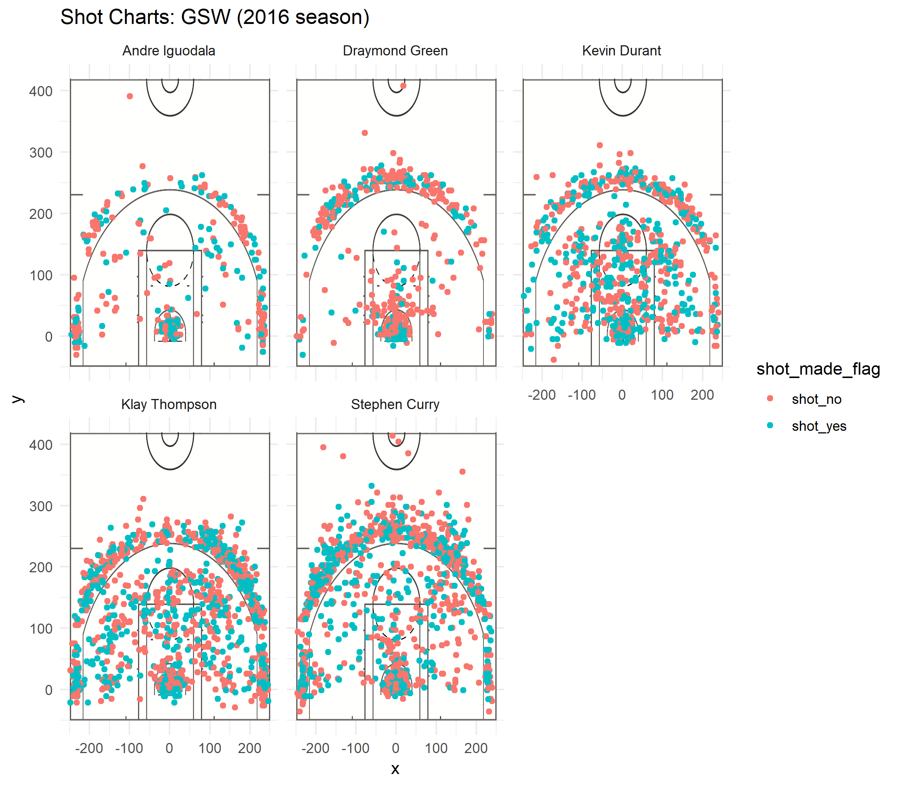

Workout1
================
Yunjae Cho

``` r
library(dplyr)
```

    ## 
    ## Attaching package: 'dplyr'

    ## The following objects are masked from 'package:stats':
    ## 
    ##     filter, lag

    ## The following objects are masked from 'package:base':
    ## 
    ##     intersect, setdiff, setequal, union

``` r
dat <- read.csv(file = "../data/shots-data.csv", stringsAsFactors = FALSE)
```

``` r
two_table <-  arrange(summarise(
  group_by(dat,name),
  total = sum(shot_type == "2PT Field Goal") ,
  made =  sum(shot_type == "2PT Field Goal" & shot_made_flag == "shot_yes"),
  percentage = made/total
), desc(percentage))

three_table <-  arrange(summarise(
  group_by(dat,name),
  total = sum(shot_type == "3PT Field Goal") ,
  made =  sum(shot_type == "3PT Field Goal" & shot_made_flag == "shot_yes"),
  percentage = made/total), desc(percentage))

alltype_table <-  arrange(summarise(
  group_by(dat,name),
  total = sum(shot_type == "2PT Field Goal" | shot_type == "3PT Field Goal") ,
  made =  sum((shot_type == "2PT Field Goal" | shot_type == "3PT Field Goal") & shot_made_flag == "shot_yes"),
  percentage = made/total), desc(percentage))

two_table
```

    ## # A tibble: 5 x 4
    ##   name           total  made percentage
    ##   <chr>          <int> <int>      <dbl>
    ## 1 Andre Iguodala   210   134      0.638
    ## 2 Kevin Durant     643   390      0.607
    ## 3 Stephen Curry    563   304      0.540
    ## 4 Klay Thompson    640   329      0.514
    ## 5 Draymond Green   346   171      0.494

``` r
three_table
```

    ## # A tibble: 5 x 4
    ##   name           total  made percentage
    ##   <chr>          <int> <int>      <dbl>
    ## 1 Klay Thompson    580   246      0.424
    ## 2 Stephen Curry    687   280      0.408
    ## 3 Kevin Durant     272   105      0.386
    ## 4 Andre Iguodala   161    58      0.360
    ## 5 Draymond Green   232    74      0.319

``` r
alltype_table
```

    ## # A tibble: 5 x 4
    ##   name           total  made percentage
    ##   <chr>          <int> <int>      <dbl>
    ## 1 Kevin Durant     915   495      0.541
    ## 2 Andre Iguodala   371   192      0.518
    ## 3 Klay Thompson   1220   575      0.471
    ## 4 Stephen Curry   1250   584      0.467
    ## 5 Draymond Green   578   245      0.424

Why are we so enthusiastic about GSW?
=====================================

There is no doubt that the GSW is the strongest team in the world. They are strong for all kinds of games, but especially at home, the GSW is invinible. They always overwhelms their opponents, even a game that seems to be defeated can lead to overtime or even reverse. In the end, their home 54-game winning streak is the NBA's best ever record.  Since 2014, Steve Kerr uncovered great players and now, they have become a legend. Stephen Curry and Klay Thompson, who are called Splash Brothers, are among the strongest in the NBA's backcourt, and eventually they have surpassed Michael Jordan's Chicago Bulls in a single season. Moreover, they have Kevin Durant who has reigned as the best scorer for years, Draymond Green with good visibility and strong defense power with Andre Iguodala.


The first reason we always get excited when we watch their game is due to their superior ability to score. We even feel relaxed when the five players mentioned above own the ball, because they succeed in scoring with a higher probability than anyone else. Here are some data of their shot percentages.

### 5 star player's 3 and 2 points success percentage

``` r
alltype_table
```

    ## # A tibble: 5 x 4
    ##   name           total  made percentage
    ##   <chr>          <int> <int>      <dbl>
    ## 1 Kevin Durant     915   495      0.541
    ## 2 Andre Iguodala   371   192      0.518
    ## 3 Klay Thompson   1220   575      0.471
    ## 4 Stephen Curry   1250   584      0.467
    ## 5 Draymond Green   578   245      0.424

If you look at the table, you can see that their shot success rate is close to 50%. **Yet, it is too early to be surprised.**

### 2 points success percentage

``` r
two_table
```

    ## # A tibble: 5 x 4
    ##   name           total  made percentage
    ##   <chr>          <int> <int>      <dbl>
    ## 1 Andre Iguodala   210   134      0.638
    ## 2 Kevin Durant     643   390      0.607
    ## 3 Stephen Curry    563   304      0.540
    ## 4 Klay Thompson    640   329      0.514
    ## 5 Draymond Green   346   171      0.494


> ***2 points? not a problem!***

The shoot success percentage for above players is over 50, which means that at least one of the two attempts will be successful. However, Andre and Kevin's two-point scorecard could make the data seem wrong. They have a 2-point shot with a probability of over 60%. They are literally a scoring machine.

### 3 points success percentage

``` r
three_table
```

    ## # A tibble: 5 x 4
    ##   name           total  made percentage
    ##   <chr>          <int> <int>      <dbl>
    ## 1 Klay Thompson    580   246      0.424
    ## 2 Stephen Curry    687   280      0.408
    ## 3 Kevin Durant     272   105      0.386
    ## 4 Andre Iguodala   161    58      0.360
    ## 5 Draymond Green   232    74      0.319

 *(The Splash Brothers: Stephen Curry and Klay Thompson)*

As a matter of fact, we must mention the "Splash Brothers" to say about scoring. You might have noticed that they have tried the most shots and their shoot success rate is miraculous. But especially, their three-point shot is close to the two-point shot rate of the other players.

If we analyze why they have such a high score success rate, it can be found in their field of activity. They are very active around the goalpost, not the one-sided attack that makes confusion in the opponent's defense. For us, this aspect approaches to us as a another activity in our head whcih we guess what will be their next move, and this can be said that their the most powerful charm.

### The position to shoot



### Summary

To sum up, Golden Gate State Warriors is a strong and popular team in many ways. They have remarkable percentage of both 3-point and 2-point shots, and their a wide range of activities playstyle always guarantee us that they will make interesting game all the time.
